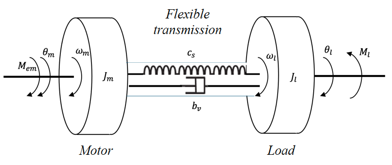
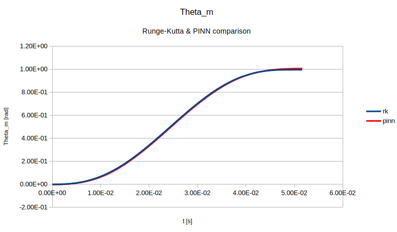

# pinn-motor
Direct and inverse PINN model of a motor with a load

The code supplied tries to solve the problem of the motor with a load specified in **Lab 1**. We have an external momentum **Mem** specified in the file **jera1.mat** which acts on mass **Jm** and indirectly on mass **Jl**. We solve the problem in three ways:
- **motor_direct.py** - uses a classical Runge-Kutta solver with time-stepping,
- **dxe_motor_direct.py** - PINN solution of an identical direct problem, using DeepXDE,
- **dxe_motor_inverse.py** - PINN solution of an inverse problem. The problem is specified in a way that the moment of inertia **Jm** is unknown, but we have several measurements of **theta_m** and **theta_l** at certain points in time. We specify **Jm** as a trainable parameter, which converges during the PINN training process.

## Direct PINN model
The results show a good match between the classical Runge-Kutta and the PINN model.

## Inverse PINN model
The inverse model PINN specifies several points *(t, theta_m, theta_m)* obtained from the classical ODE solver, trying to obtain the real value of **Jm** through the process of training. After 200.000 training iterations, the value of **Jm** becomes 0.000625 which is close to a real value of 0.00062. 
