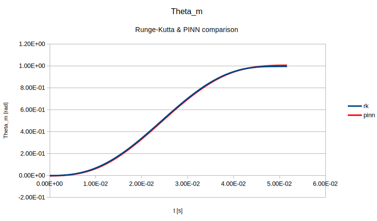
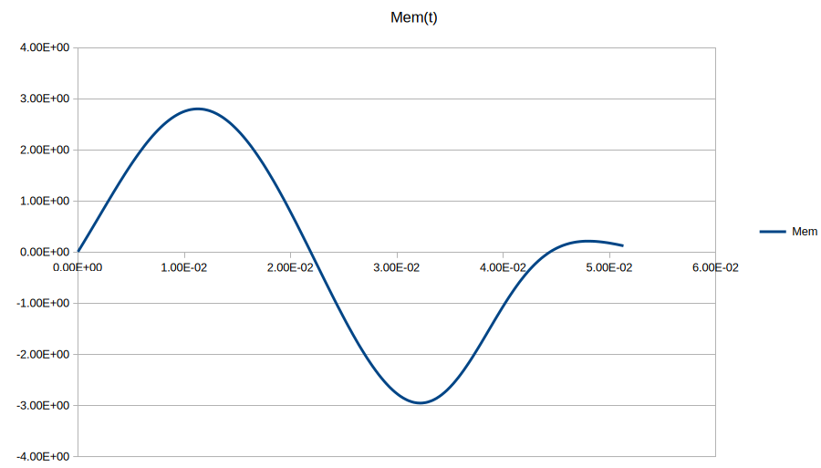
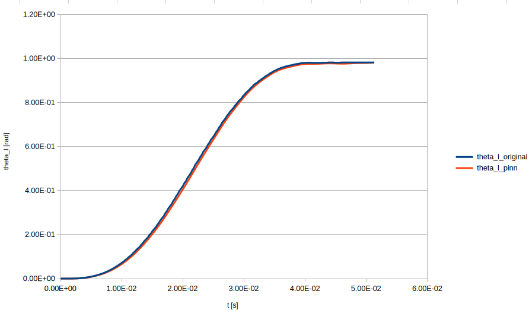

# Direct PINN model
This DeepXDE-based PINN models a two-degree-of-freedom torsional system governed by second-order ODEs. 
It begins by loading experimental torque data from a MATLAB file and interpolating it using TensorFlow Probability to provide continuous input for the equations. 
The neural network predicts motor and load angular displacements, and their first and second derivatives are computed using automatic differentiation. 
The governing ODEs enforce system dynamics by balancing inertia, torsional stiffness, damping, and external torque. 
Initial conditions set both angular displacements and their velocities to zero at the start, while operator boundary conditions ensure physically meaningful constraints. 
A fully connected neural network with two hidden layers of 80 neurons each is trained using the Adam optimizer with a learning rate of 0.001. 
After training, the model predicts angular displacements over time, and the results are saved for further analysis.

## Results
The results show a good match between the classical Runge-Kutta and the PINN model.

# Inverse PINN model (1)
This first inverse PINN model estimates the motor inertia **Jm** in a two-degree-of-freedom torsional system by treating it as a trainable parameter. 
The model starts by loading experimental torque data from a MATLAB file, which is interpolated using TensorFlow Probability to provide a smooth function for external torque over time. 
The governing ODEs are formulated to capture the system dynamics, including inertia, torsional stiffness, damping, and external torque effects. 
Unlike the forward model, where system parameters are fixed, this model introduces **Jm** as a learnable variable constrained within a predefined range. 
Initial conditions enforce zero displacements and velocities at the start, while additional boundary conditions ensure physical consistency. 
The model also incorporates **point-set boundary conditions** from experimental data. We specify several points **(t, theta_m, theta_m)** obtained from the classical ODE solver.
A fully connected neural network with two hidden layers of 80 neurons each is trained using the Adam optimizer. 
The learned value of **Jm** is printed at the end, and the predicted angular displacement of the load is saved for further analysis.

## Results of the inverse model (1)
After 200k training iterations, the value of **Jm** becomes 0.000625 which is close to a real value of 0.00062. 

# Inverse PINN model (2)
The second inverse model is more complex. Having all system parameters known, it tackles the problem of calculating the complete **Mem(t)** series, having the desired output **theta_l(t)**. We employ the PINN using the script **dxe_motor_inverse7.py**. It reads the desired output from the file **theta_l211.txt**. The PINN is similar to the previous one but now uses 8000 collocation points to calculate loss. We carry out PINN training in two phases: 
* 100k iterations with a learning rate of 1e-03, and
* 400k iterations with a training rate of 2e-04. 
Upon training completion, the file **Mem_finetuned.txt** contains one of the solutions for the input signal **Mem(t)**. It looks like this:

## Results of the inverse model (2)
We can check if this input leads us to the correct output using the script **motor_direct.py** which resides in the same directory. The comparison between calculated **theta_l(t)** and the same quantity taken from the file **theta_l211.txt** gives the following:

